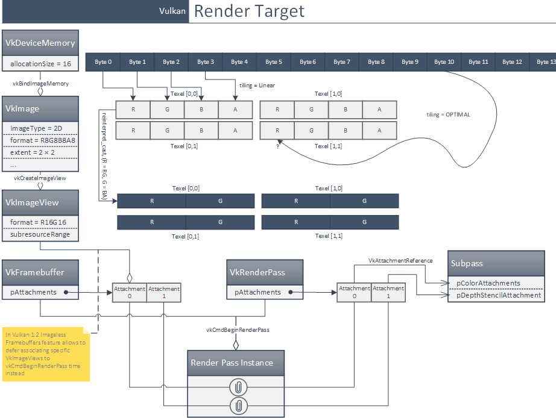

# Vulkan

- VkFramebuffer + VkRenderPass定义了渲染目标。
- VkRenderPass定义了哪些附件将被写入颜色。
- VkFramebuffer定义了哪个VkImageView将成为哪个附件。
- VkImageView定义了要使用VkImage的哪一部分。
- VkImage定义了使用哪个VkMemoryVkDeviceMemory和一个texel的格式。

也可能是以相反的顺序。  

- VkDeviceMemory只是内存中N个字节的一个序列。
- VkImage对象为它添加了例如关于格式的信息（所以你可以通过文本数而不是字节数来寻址）。
- VkImageView对象有助于只选择VkImage的一部分（数组或mip）（像stringView、arrayView或whathaveyou那样）。还可以帮助匹配一些不兼容的接口（通过类型转换格式）。
- VkFramebuffer将一个VkImageView与一个附件绑定。
- VkRenderpass定义了哪个附件将被绘制到

https://stackoverflow.com/questions/39557141/what-is-the-difference-between-framebuffer-and-image-in-vulkan/39559418#39559418  



## API
**Context**  
  ```CPP
  context 
  ```

**Physic device**  
  ```CPP
  context 
  ```

**Surface**  
  ```CPP
  context 
  ```

**logic device**  
  ```CPP
  context 
  ```

**shader**  
  ```CPP
  context 
  ```

**Vertex Layout**  
  ```CPP
  context 
  ```

**Uniform Layout**  
  ```CPP
  vkCreateDescriptorSetLayout(device, &layoutInfo, nullptr, &descriptorSetLayout)
  ```

**Pipeline**  
  ```CPP
  VkVertexInputBindingDescription    // Vertex stride
  VkVertexInputAttributeDescription  // Vertex fields
  VkPipelineInputAssemblyStateCreateInfo // topology
  // VkDescriptorSetLayout --> VkPipelineLayout 
  vkCreateGraphicsPipelines(device, VK_NULL_HANDLE, 1, &pipelineInfo, nullptr, &graphicsPipeline) 
  ```

**Vertex Buffer**   
  ```CPP
  context 
  ```

**Index buffer**  
  ```CPP
  context  
  ```

**Uniform buffer**  
  ```CPP
  // VkDescriptorPool VkDescriptorSetLayout --> VkDescriptorSet
  vkCreateBuffer(device, &bufferInfo, nullptr, &buffer);
  vkCreateDescriptorPool(device, &poolInfo, nullptr, &descriptorPool);
  vkAllocateDescriptorSets(device, &allocInfo, descriptorSets.data());
  // VkBuffer--> VkDescriptorSet
  vkUpdateDescriptorSets(device, 1, &descriptorWrite, 0, nullptr);
  ```

**command buffer**  


## 渲染过程
```CPP
vkBeginCommandBuffer(drawCmdBuffers[i], &cmdBufInfo);
vkCmdBeginRenderPass(drawCmdBuffers[i], &renderPassBeginInfo, VK_SUBPASS_CONTENTS_INLINE);
vkCmdSetViewport(drawCmdBuffers[i], 0, 1, &viewport);
vkCmdSetScissor(drawCmdBuffers[i], 0, 1, &scissor);

vkCmdBindPipeline(drawCmdBuffers[i], VK_PIPELINE_BIND_POINT_GRAPHICS, pipeline);
vkCmdBindVertexBuffers(drawCmdBuffers[i], VERTEX_BUFFER_BIND_ID, 1, &vertexBuffer.buffer, offsets);
vkCmdBindIndexBuffer(drawCmdBuffers[i], indexBuffer.buffer, 0, VK_INDEX_TYPE_UINT32);

for (uint32_t j = 0; j < OBJECT_INSTANCES; j++) {
  vkCmdBindDescriptorSets(drawCmdBuffers[i], VK_PIPELINE_BIND_POINT_GRAPHICS, pipelineLayout, 0, 1, &descriptorSet, 1, &dynamicOffset);
  vkCmdDrawIndexed(drawCmdBuffers[i], indexCount, 1, 0, 0, 0);
}

vkCmdEndRenderPass(drawCmdBuffers[i]);
VK_CHECK_RESULT(vkEndCommandBuffer(drawCmdBuffers[i]));

```
