# ADAS地图

---
## 地图结构
ADAS地图区域按照block（块）和region（区）来划分的，一共有512×512个block，每个block有4×4个region。实际程序中并没有block的概念，全部按照region来存储。每一个region都有一个唯一的编号regionID，里面有若干个link，每个region内的linkID从0开始直至link数量-1，地图界面显示的linkID实际是由regionID和region中的linkID进行组合得到，具有唯一性。  
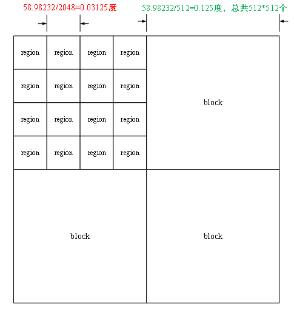

---
经过编译后的地图文件，文件头结构体中包含了地图文件的基本信息。其中，**x1Num**表示block数组的行数，y1表示block数组的列数，block总数为512×512；**x2Num**表示一个block中region数组的行数，**y2Num**表示一个block中region数组的列数，一个block中region的个数为4×4。紧邻着_head，是一个大小为`(x1Num*x2Num+1)`的`uint32_t`类型的数组，这个数组中存放着所有block的首地址。通过block号可以快速找到相应的block存储的位置。找到block之后，可以根据regionID找到相应的region。  
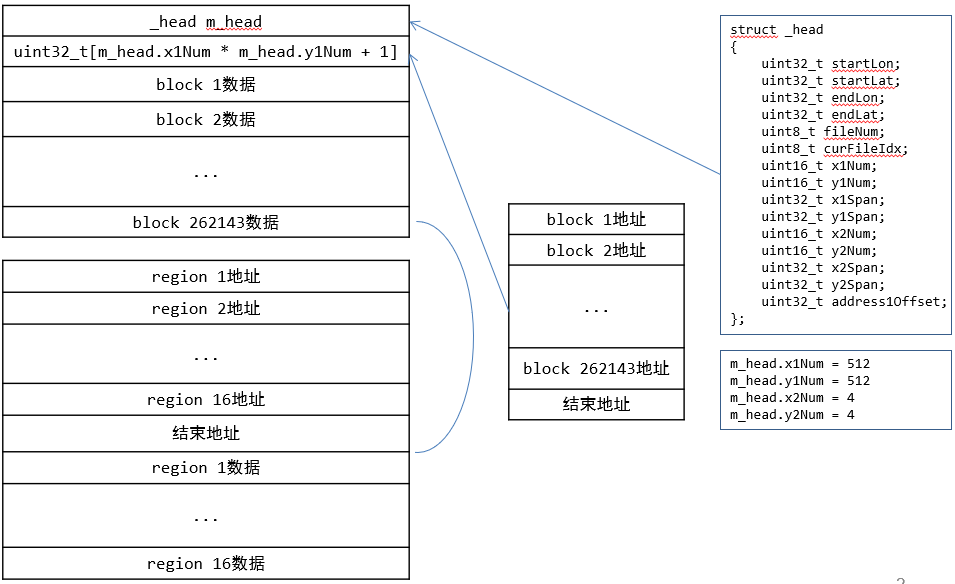

---
## 定位流程
从GPS获取到原始经纬度坐标之后，经过转换，得到02坐标。然后进行道路匹配以及更新自车信息。  
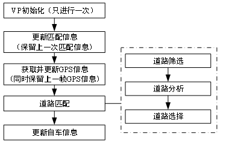

---
## 框选道路
首先设置矩形筛选框，当前GPS点经纬度为矩形中心，矩形尺寸为0.001846°*0.001846°，四个角点即当前GPS点经纬度±0.0009223°。筛选框比region小得多，所以筛选框最多关联4个region。  
> 矩形框边长根据经纬度计算可得204m。

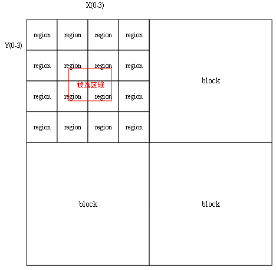

---
1. 先获取每个region内的道路数量。
2. 获取全部region所有道路。
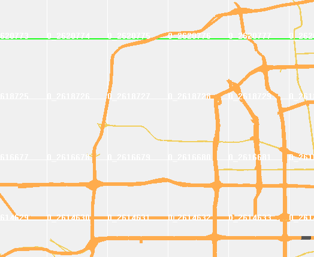

---
## 分析道路几何并筛选
读取道路的形点数据，丢弃重合点，丢弃筛选框以外的点，计算车辆与道路的相对夹角，丢弃反向的单向道路（比较point- pointNext角度和GPS方向）。再计算垂足和垂距，筛选出道路。  
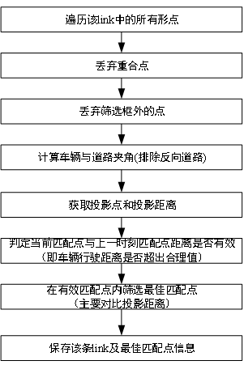

---
### 匹配矩形框
根据道路中形点的经纬度，分别找到形点中经度最大和最小的两个点以及纬度最大和最小的两个点，获得一个包含道路的矩形框。道路矩形框与筛选框有相交才保留。
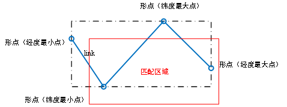

---
形点和筛选框位置关系如上图所示，利用前后两个形点和筛选框的位置关系来丢弃筛选框外的线段（若两形点都在矩形框外，但是连线与矩形框相交，也视作相交）。
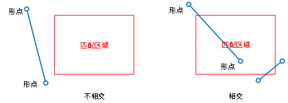

---
### 计算夹角
选取出全部的线段后计算夹角。
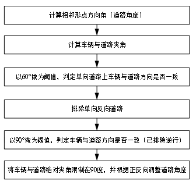

---
步骤1：计算道路角度（两点航向角），也就是计算两点经纬间的方位角point- pointNext（正北为0度，顺时针递增）  
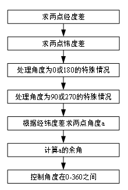

---
步骤2：计算车辆与道路夹角，分为计算绝对角度差和计算方向两步。计算绝对角度差是求取GPS点的角度和上一步求出两点方位角的差。计算方位是用第一步得出的绝对角度差和60度进行比较。  
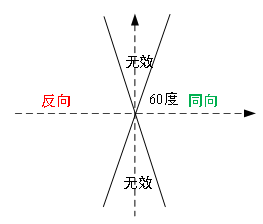

---
步骤3：排除方向道路，在单向道路时，如果步骤2求得的方向与道路方向相反，则放弃该形点，如果是双向道路则不需要，若为其它道路类型（实际不会出现），则同样放弃。  
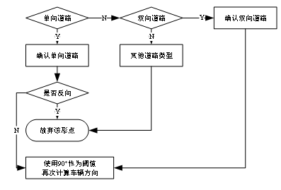

---
步骤4：计算自车与道路的相对夹角，将GPS获得的角度作为车辆角度，将步骤1求得的两点方位角作为道路角度，同时带入道路的单双向信息，计算出自车与道路的夹角，这里的处理会根据道路的单双向属性来确定最终角度。  
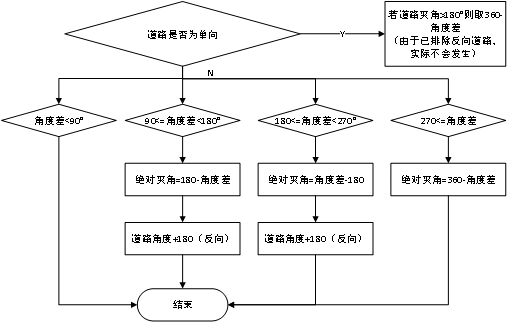

---
### 计算最佳匹配点
- 计算匹配点和投影距离。
- 计算垂足，再根据垂足的位置计算垂距或匹配点到形点的距离。

> 计算车辆位置与link之间的垂距，如果垂足在link上，就取垂足为匹配点，如果垂足不在link上而是在延长线上，就取最近的形状点为匹配点。这样的话，在每段link上就能找到一个匹配点.
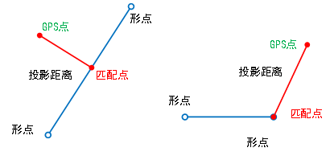
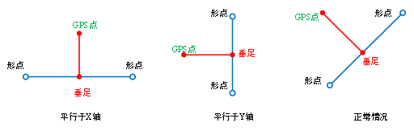

---
如果“上一时刻匹配状态为onroad，且上一时刻匹配点与当前匹配点在同一region、同一link”，则需要计算上一时刻匹配点和当前匹配点在同一link上的距离matchP2PDist。该距离不是直接计算两点间距，而是需要用累加形点线段距离代替，点越密集越接近真实值，所以采用分三段求取距离然后相加。在计算时，需要注意方向，匹配点是向形点编号变大的方向还是变小的方向运动，根据形点编号的变化进行累加。
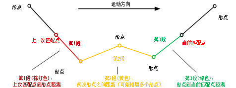

---
最后需要判断是否用新的匹配点代替旧的，满足替换的条件是以下四点之一。
- 新点在link上，旧点不在link上，新匹配点投影距离<=旧匹配点投影距离+3m；
- 新点不在link上，旧点在link上，旧匹配点投影距离>新匹配点投影距离+5m；
- 新点不在link上，旧点不在link上，新匹配点投影距离<旧匹配点投影距离；
- 新点在link上，旧点在link上，新匹配点投影距离<=旧匹配点投影距离。
> +3m +5m等是经验值，需要根据实际测试进行手工调整

---
## 计算道路权重
道路分析，主要是计算道路误差权重，其组成如下：
1. 分别计算可信度、可信度等级，获得可信度误差。
2. 根据GPS方向和道路夹角，计算道路夹角误差。
3. 根据车辆位置到道路的投影距离，计算投影距离误差。
4. 根据投影偏移量，计算投影误差。
5. 根据有效行驶距离，计算有效行驶距离误差。
6. 根据速度与道路等级，计算速度匹配误差。
7. 根据道路类型变化，得到道路类型变化误差。
8. 特殊场景处理。

---
把所有的误差相加，即得到道路误差权重，并对权重进行排序。  
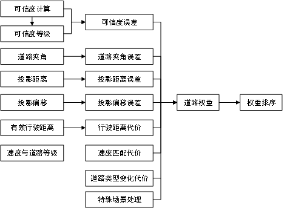

---
### 计算可信度
- **可信度（relibility）**： 可信度越高代表该条道路越容易被选中
- **可信度等级（relibilityLevel）**：可信度等级越高误差权重越大越不容易被选中
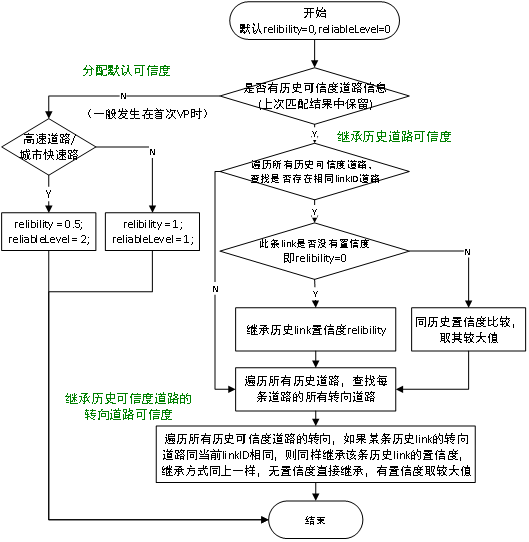

---
**计算可信度等级**  
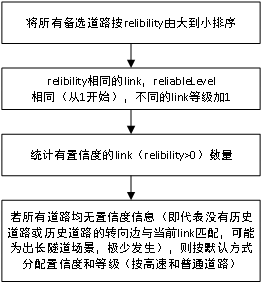

---
**计算可信度误差**    
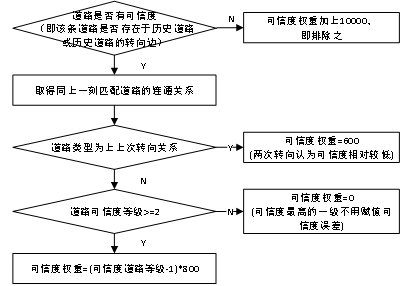

---
### 计算有效行驶距离误差

---
### 计算道路连通关系与夹角误差

---
### 计算投影距离误差

---
### 计算投影偏移误差

---
### 计算速度匹配误差

---
### 计算道路类型变化误差

---
### 特殊场景处理

---
### 计算道路总权重
- **计算固定权重**：固定因数误差权重=夹角误差+有效行驶距离误差+投影距离误差+投影偏移误差+速度匹配误差+道路类型误差+特殊场景处理。
- **计算可信度权重**：可信度误差计算见1.7.1，涉及到所有道路的可信度排序。
- **误差总权重排序**：对筛选道路按照误差总权重从小到大排序。
