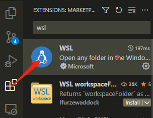
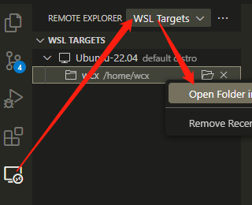

# WSL

## 安装
1. 开启windows子系统功能
   win11开始->设置->应用->更多windows功能勾选`适用于Linux的Windows之系统`和`虚拟机平台` 

2. 升级WSL到最新（需翻墙）
   ```sh
   $ wsl --update
   ```

   如果更新不了，可以手动更新，进入[官方页面](https://learn.microsoft.com/zh-cn/windows/wsl/install-manual#step-4---download-the-linux-kernel-update-package)，下载安装 “适用于 x64 计算机的 WSL2 Linux 内核更新包”。
   
3. 安装Linux发行版

    ``` shell
    $ wsl --list --online            # 列出可用的 Linux 发行版
    $ wsl --install -d <DistroName>  # 安装发行版
    ```
    
    如果出现如下报错，说明WSL版本不够新，不支持这个版本，需要升级更新WSL。
    
    ``` sh
    Installing, this may take a few minutes...
    WslRegisterDistribution failed with error: 0x800701bc
    Error: 0x800701bc WSL 2 ?????????????????? https://aka.ms/wsl2kernel
    ```

## 基本用法

```sh
$ wsl -l -v                # 列出安装好虚拟机
$ wsl -d <NAME>            # 进入虚拟机，不指定名字进入默认虚拟机
$ wsl --unregister <NAME>  # 删除虚拟机
```

## 在VS Code中使用

在VS Code中安装微软官方WSL扩展 `Extensions -> WSL -> Install` 
  

在VS Code中打开WSL，`Remote Explorer -> WSL Targets -> 右键Open Folder in WSL`
  
